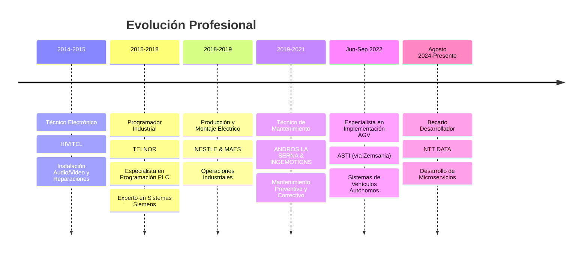

# 🚀 Sergio Moro | Ingeniero en Automatización Industrial y Software

---

## 🌟 Sobre Mí

> **Transformando procesos industriales a través de soluciones de automatización y software inteligente de vanguardia**

Soy un apasionado **Ingeniero en Automatización Industrial** y **Desarrollador de Software** con más de **8 años** de experiencia práctica en entornos industriales. Actualmente cursando **Ingeniería Informática** mientras trabajo en proyectos revolucionarios de automatización que conectan la industria tradicional con la tecnología moderna.

### 🎯 Lo Que Me Impulsa
- Defensor de la **Revolución Industrial 4.0**
- Virtuoso en **Programación PLC** (especialista en Siemens)
- Implementador de **Robótica** y sistemas **AGV**
- **Desarrollo full-stack** con enfoque industrial
- **Inteligencia Artificial** aplicada a la industria

---

## 🛠️ Arsenal Técnico

### 💻 Lenguajes de Programación

### 🌐 Desarrollo Web & Backend

### 🤖 Inteligencia Artificial

### 🏭 Automatización Industrial

### 🤖 Robótica y Manufactura

### 🛠️ Herramientas de Desarrollo

---

## 🚀 Proyectos Destacados

### 🎨 **1. Plataforma de Moda con IA - Adaptación Virtual de Prendas**

**Una revolución en el mundo de la moda digital**

- 🤖 **IA Generativa** para crear modelos humanos desde cero
- 👗 **Adaptación automática** de cualquier tipo de prenda a modelos virtuales
- 🌐 **Página web completa** para promocionar y demostrar la tecnología
- 🎯 **Computer Vision** y **Machine Learning** aplicados a la industria textil
- ✨ **Interfaz intuitiva** que permite a usuarios subir prendas y ver resultados instantáneos

> *"Transformando la manera en que las marcas presentan sus productos, eliminando la necesidad de sesiones fotográficas tradicionales"*

---

### 🤖 **2. API Inteligente de Automatización Empresarial**

**Automatización inteligente de comunicaciones empresariales**

- 📊 **Integración con bases de datos** empresariales
- 🧠 **IA personalizada** para generar mensajes automáticos
- ⚡ **API RESTful** de alto rendimiento
- 📱 **Mensajes personalizados** basados en datos del cliente
- 🔄 **Automatización completa** del flujo de comunicación

> *"Revolucionando la comunicación empresarial con IA, ahorrando horas de trabajo manual y mejorando la personalización"*

---

### 🎓 **3. Aplicación Web Universitaria con Vue.js**

**Proyecto académico con tecnologías modernas**

- 🖥️ **Vue.js** como framework principal
- 📱 **Responsive design** para múltiples dispositivos
- 🎨 **UI/UX moderno** y funcional
- 🔧 **Arquitectura escalable** y mantenible

---

## 💼 Trayectoria Profesional

### 🏆 Logros Clave

<table>
<tr>
<td width="50%">

#### 🎯 **TELNOR (2015-2018)**
- **Experto en Programación PLC** (Siemens TIA Portal, Step 7, PCS7)
- Contribución a proyectos importantes en **Solvay** y **AZSA**
- Especialización en **desarrollo HMI** y **automatización industrial**
- Modificación de esquemas eléctricos en **AutoCAD**

</td>
<td width="50%">

#### 🤖 **Rol Actual (Agosto 2024-Presente)**
- **Becario Desarrollador de Microservicios** en NTT DATA
- Desarrollo de **arquitecturas distribuidas**
- **Microservicios** con tecnologías modernas
- Aplicación de **metodologías ágiles**

#### 🚀 **Experiencia Reciente (Jun-Sep 2022)**
- **Técnico de Implementación AGV** en ASTI (vía Zemsania)
- Despliegue de **sistemas de vehículos autónomos**
- **Integración robótica** industrial
- Soluciones de **automatización de vanguardia**

</td>
</tr>
</table>

---

## 🎓 Excelencia Académica

| 📚 Título | 🏫 Institución | 📅 Año | 🎯 Especialización |
|-----------|----------------|---------|-------------------|
| **Ingeniería Informática** | Universidad del Atlántico | 2022-Presente | Desarrollo de Software y Sistemas |
| **Automatización Industrial y Robótica** | Nuestra Señora de los Remedios | 2015-2018 | Programa de Formación Dual |
| **Instalaciones de Telecomunicaciones** | Centro Integrado Nº1 Santander | 2011-2014 | Fundamentos Técnicos |

---

## 📊 Estadísticas de GitHub

 

---

## 🌟 Certificaciones y Competencias Adicionales

### 🚗 Licencias y Certificaciones

### 🎥 Multimedia y Diseño

---

## 🤝 Conectemos y Colaboremos

---

### 💡 "Conectando la industria tradicional con la tecnología del futuro"

**¡Disponible para proyectos emocionantes de automatización, consultoría industrial y desarrollo de software innovador!**

---

*⭐ ¡Dale estrella a mis repositorios si te parecen interesantes!*

